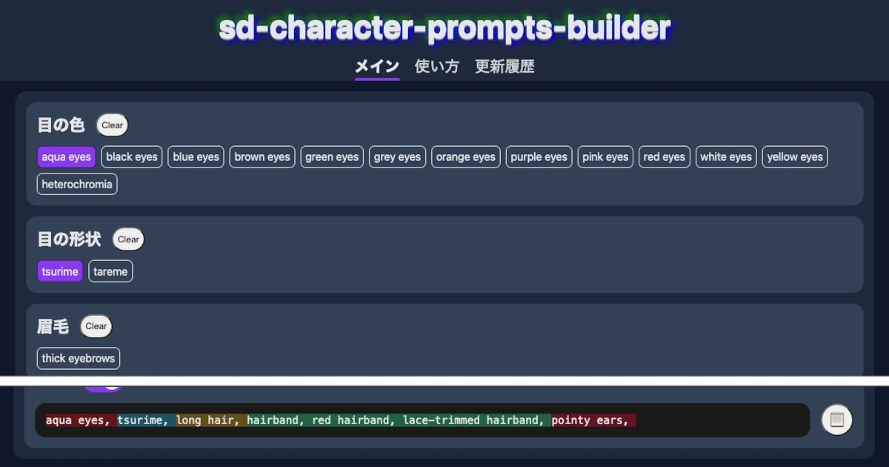

# sd-character-prompts-builder



You can easily build prompts for your favorite characters❗

## 🍎 Use

- [Use❗](https://tenpamk2-blog.netlify.app/apps/sd-character-prompts-builder/)

## ✨ Features

- Choose prompt by just pressing buttons.
- Color picker for color prompts.
- Grouping for related prompts.

## 🚗 Run on your local machine

`git clone` this repository.
Then, execute following commands.

```sh
npm install
npm run dev
```

## 🔧 Setup `.env`

If you want to deploy this app,
create `/.env` file and set your Google Analytics Measurement ID like below.

```txt
GOOGLE_MEASUREMENT_ID="G-**********"
```

## 📖 Tech stack

- [Astro](https://astro.build/)
- [Vite](https://vitejs.dev/)

No Reacts❗ No CSS framework❗

## 🤔 Ask questions or report bugs

Create issue ticket❗
Or, contact me via the following.

- Twitter: [@tenpaMk2](https://twitter.com/tenpaMk2)
